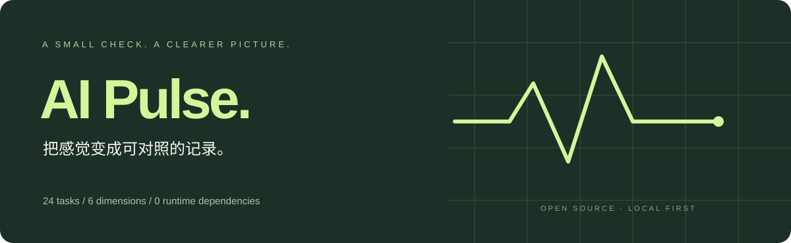

<div align="center">



# AI Pulse · AI 状态体检

**今天的 AI，还在状态吗？用可复现的题目和历史记录，观察模型表现变化。**

中文 · [English](README.en.md) · [评分方法](docs/methodology.md) · [参与贡献](CONTRIBUTING.md)


</div>

你可能遇到过：昨天能做对的题，今天答错了；同样的提示词，这次却漏掉要求。AI Pulse 帮你留下可复查的记录，而不是只靠印象争论“是不是降智了”。

它是一个轻量的**表现回归检查工具**，不是模型身份探测器，也不能证明平台暗中降低算力。24 道公开题目覆盖有限能力，不能当作通用智力分数或权威排行榜。

## 可以做什么

| 功能 | 内容 |
| --- | --- |
| 聊天窗口测试 | 复制题目到 ChatGPT、DeepSeek 或其他聊天产品，粘贴 JSON 回答即可评分，无需 API Key |
| API 自动测试 | 支持 OpenAI、DeepSeek、OpenRouter 的 Chat Completions 接口；模型 ID 自行填写 |
| 六个维度 | 数值计算、逻辑推理、代码理解、指令遵循、信息提取、上下文检索，每类 4 题 |
| 可复现题组 | 种子生成题目参数；相同版本、种子得到同一题组。部分控制题保持固定 |
| 透明判分 | 不调用第二个 AI 当裁判；按公开答案检查 JSON 类型、数字、布尔值及数组顺序 |
| 基线与历史 | 同条件比较、分维度得分、历史趋势；API 支持每题重复 1 / 3 / 5 次 |
| 可导出 | JSON 原始记录、Markdown 简报；导入时根据原始回答重新评分 |
| 本机优先 | 无运行依赖、无分析追踪；API Key 不写入磁盘或浏览器持久存储 |

## 30 秒启动

需要 [Node.js 20 或以上](https://nodejs.org/)。不需要 `npm install`。

```bash
git clone https://github.com/bohuis686-creator/ai-pulse.git
cd ai-pulse
npm start
```

打开 **http://127.0.0.1:8787**。

Windows 也可以下载仓库 ZIP、解压，再双击 `Start-Windows.cmd`。若浏览器早于服务启动，刷新一次页面。macOS / Linux 使用上面的命令。端口冲突时可修改 `PORT` 环境变量。

## 测 ChatGPT / DeepSeek 聊天网页

1. 保留题目种子，填写模型与设置备注，例如“ChatGPT · 界面所选模型 · 思考开启”。
2. 点击“复制 24 道测试题”，在被测产品中**新建空白对话**，关闭联网和代码工具，保持思考设置一致。
3. 把模型的完整 JSON 回答粘回 AI Pulse，点击评分。
4. 检查未通过题目的原始回答和标准答案，将本次记录设为基线。
5. 之后用相同种子、模式和模型设置再次测试，观察变化；建议跨多个时间段重复。

手动模式一次发送整套题，题目会共享上下文。API 模式则逐题独立请求，**两种模式不能直接比较**。工具无法强制关闭聊天产品隐藏的工具、记忆或路由，备注和设置需要你核对。

## 测 API

选择服务商 → 填写模型 ID 和 API Key → 选择重复次数 → 开始。

- 1 轮为 24 次请求，3 轮为 72 次，5 轮为 120 次，**服务商可能收费**。
- 模型 ID 以你的服务商控制台为准，不假设所有账号都有相同模型权限。
- Temperature、Reasoning effort 默认省略；只在模型明确支持时填写。测试不设置工具，不使用多轮对话。
- 输出 token 默认上限为 4096。推理模型可能需要更多预算；截断会使本轮停止，不会被误记为能力错误。提高上限后重新建立基线。
- 网络失败、鉴权失败、限流或接口错误会立即停止；不会自动重试付费请求，也不会把不完整轮次保存为完整报告。
- “停止”会中断本地等待并停止后续调用；已提交的请求可能仍由服务商处理和计费。
- 暂不提供任意自定义 API 地址或本地模型地址，防止本地服务成为任意目标代理。

**API 测到的是对应 API 端点，不等同于 ChatGPT 或 DeepSeek 聊天产品的体验。**

## 结果应该怎么读

正确率 = 正确回答数 / 可评分回答数。格式不合要求记为未通过；接口故障和截断单列，不参与“能力下降”判断。响应耗时包含网络与排队，不能单独用于推断智力。

自动比较要求题集版本、种子、模式、服务商、模型名、重复次数、token 上限和可选参数相同。每题重复至少 3 次后，工具按题目进行 2,000 次配对 bootstrap 重采样。当平均得分下降至少 10 个百分点，且探索性的 95% 区间上界小于 0，显示“下降信号”。

这是一个预警规则，**不是经过校准的诊断阈值，也不是因果结论**。共享模板、题目污染、随机采样、隐式模型更新和思考预算都可能影响结果。详见[方法与局限](docs/methodology.md)。

## 隐私与验证范围

- 服务只绑定 `127.0.0.1`，不对局域网开放；检查 Host、Origin 和随机会话令牌。
- Key 只在输入框及本机请求内存中短暂使用，最终仅发给选定服务商；完成、失败或取消后清空输入框。不写日志、导出报告或 localStorage。
- 回答和历史记录保存在当前浏览器，最多 10 份。浏览器清理数据或更换端口可能使历史不可见，请导出需要保留的 JSON。
- 演示数据明确标记为合成数据，不能设为真实评测基线。
- 自动化测试覆盖题库、评分、比较、导入、接口参数、HTTP 流程与基本访问限制。API 流程使用模拟响应验证；未内置或使用任何真实密钥。
- 云端浏览器无法访问开发环境的回环地址，本版尚未完成真实浏览器端到端视觉验收。

## 开发

```bash
npm test
npm run check
```

```text
src/server.js       本地 HTTP 服务、流式进度、取消与会话校验
src/provider.js     服务商白名单、参数验证和 API 请求
web/core.js         可复现题库、判分、报告与对比逻辑
web/app.js          界面交互、历史和导出
web/index.html     页面结构
web/style.css      响应式样式
tests/             Node 内置测试，无真实 API 消耗
```

文档参考：[OpenAI Chat API](https://developers.openai.com/api/reference/resources/chat)、[DeepSeek API](https://api-docs.deepseek.com/)。不同模型和服务商的支持范围可能变化，请以实际接口反馈和官方文档为准。

欢迎提交有**唯一、可解释答案**的新题、真实边界案例或评分错误。不要公开 API Key 或带私人内容的报告。

## License

[MIT](LICENSE) · Created by [bohuis686-creator](https://github.com/bohuis686-creator).
